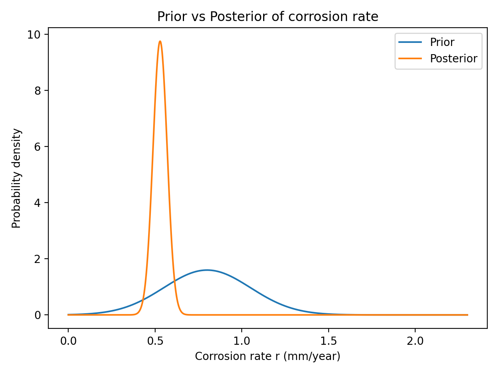
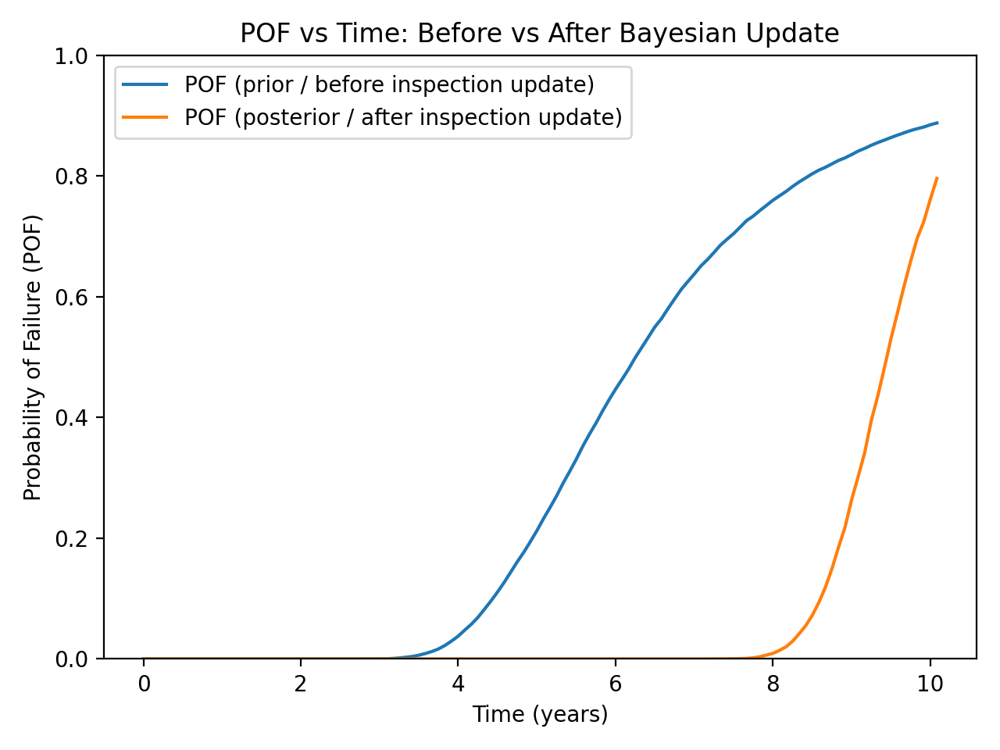
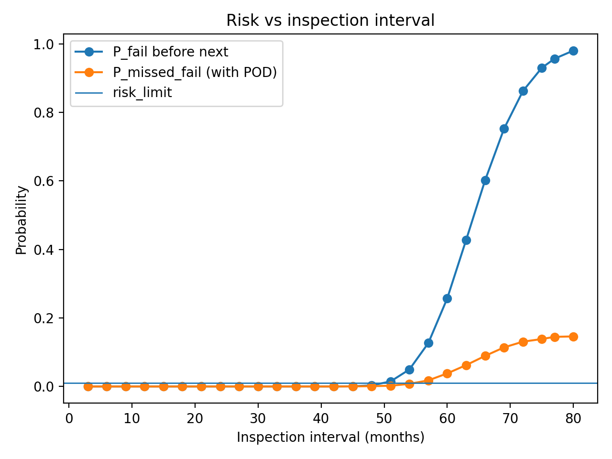
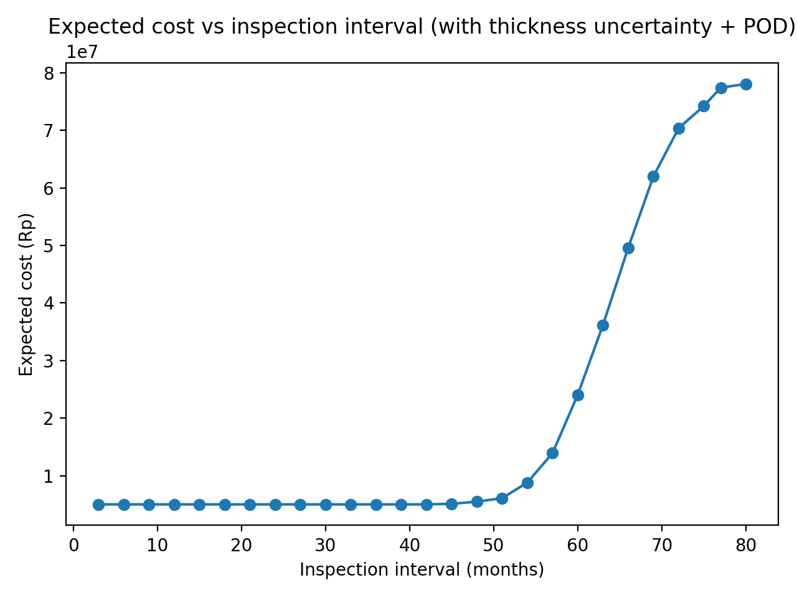
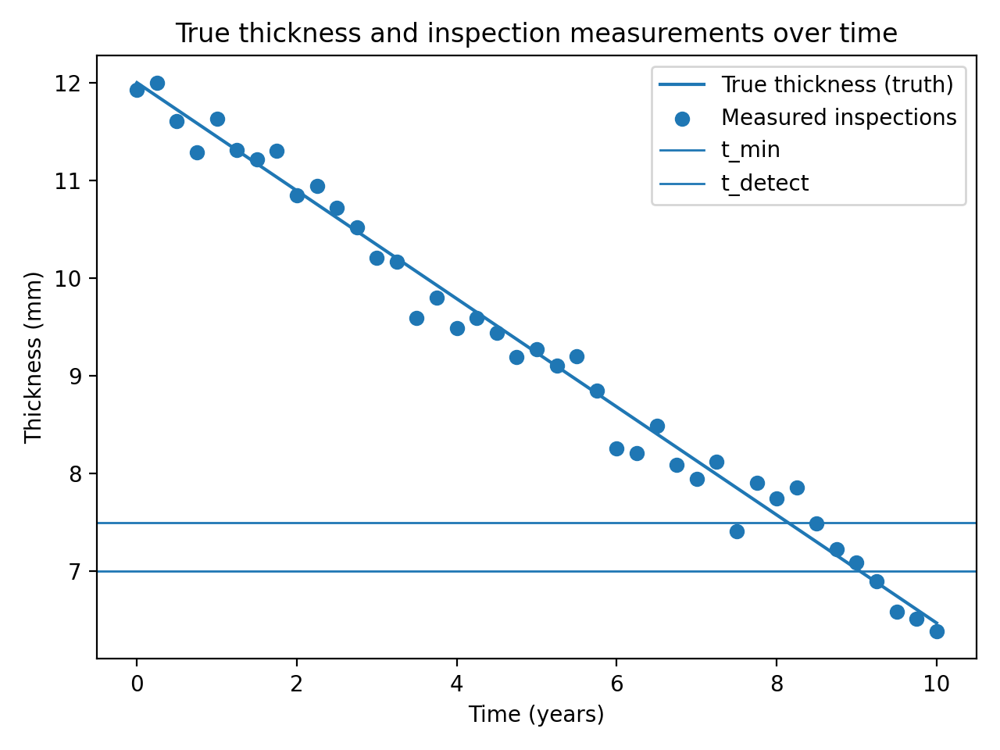

# RBI-lite: Risk-Based Inspection Scheduling with Bayesian Updating + POD

## What this project does (non-technical)
Industrial assets (pipes/vessels) lose thickness due to corrosion. Inspections are expensive, but late inspections can lead to failures.
This project simulates a simple, realistic decision system to recommend inspection intervals by balancing:
- uncertainty in corrosion rate,
- uncertainty in thickness measurements,
- imperfect inspection detection (POD),
- inspection cost vs failure consequence.

## Key outputs
1) Prior vs posterior corrosion rate after using inspection data  

2) Risk (Probability of Failure) before vs after Bayesian update  

3) Recommended next inspection interval based on risk limit + cost (with POD)  
  

4) Multi-cycle policy simulation (adaptive inspection scheduling over time)  

## Method overview (technical, short)
- Corrosion model: thickness(t) = t0 - r*t
- r is uncertain and updated using Bayesian grid update based on inspection measurements.
- Failure defined when thickness < t_min
- Inspection measurement has noise (meas_std).
- POD model: even if the asset is near-failure, an inspection may miss it (POD < 1).
- Decision rule chooses next inspection interval minimizing expected cost under a risk limit.

## How to run
1) Create a virtual environment (recommended)
2) Install dependencies:
   `pip install -r requirements.txt`
3) Open notebooks in order:
   - notebooks/02_step2_monte_carlo_pof.ipynb
   - notebooks/03_step3_generate_inspection_data.ipynb
   - notebooks/04_step4_bayesian_update_grid.ipynb
   - notebooks/05_step5_optimize_next_interval_with_uncertainty_pod.ipynb
   - notebooks/06_step6_simulate_policy_multicycle.ipynb

## Notes / limitations
- This is a simplified demo model (linear corrosion, simplified POD).
- Real RBI would include damage mechanisms, inspection POD curves, and repair actions.